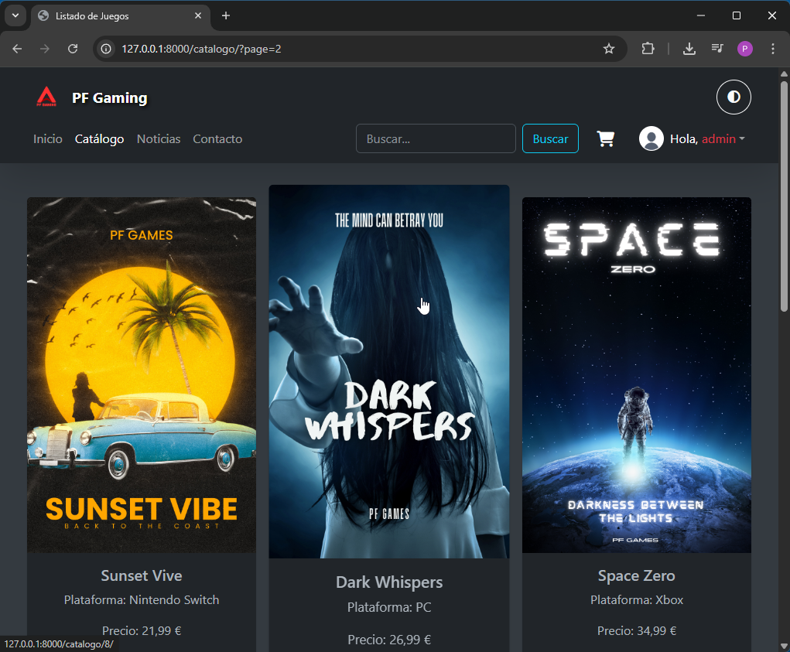
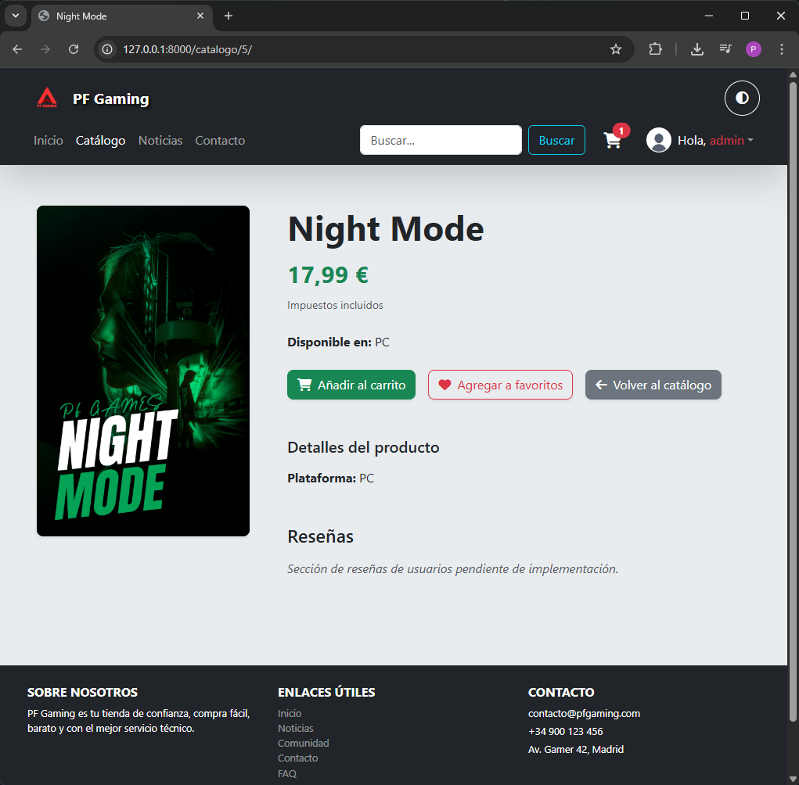
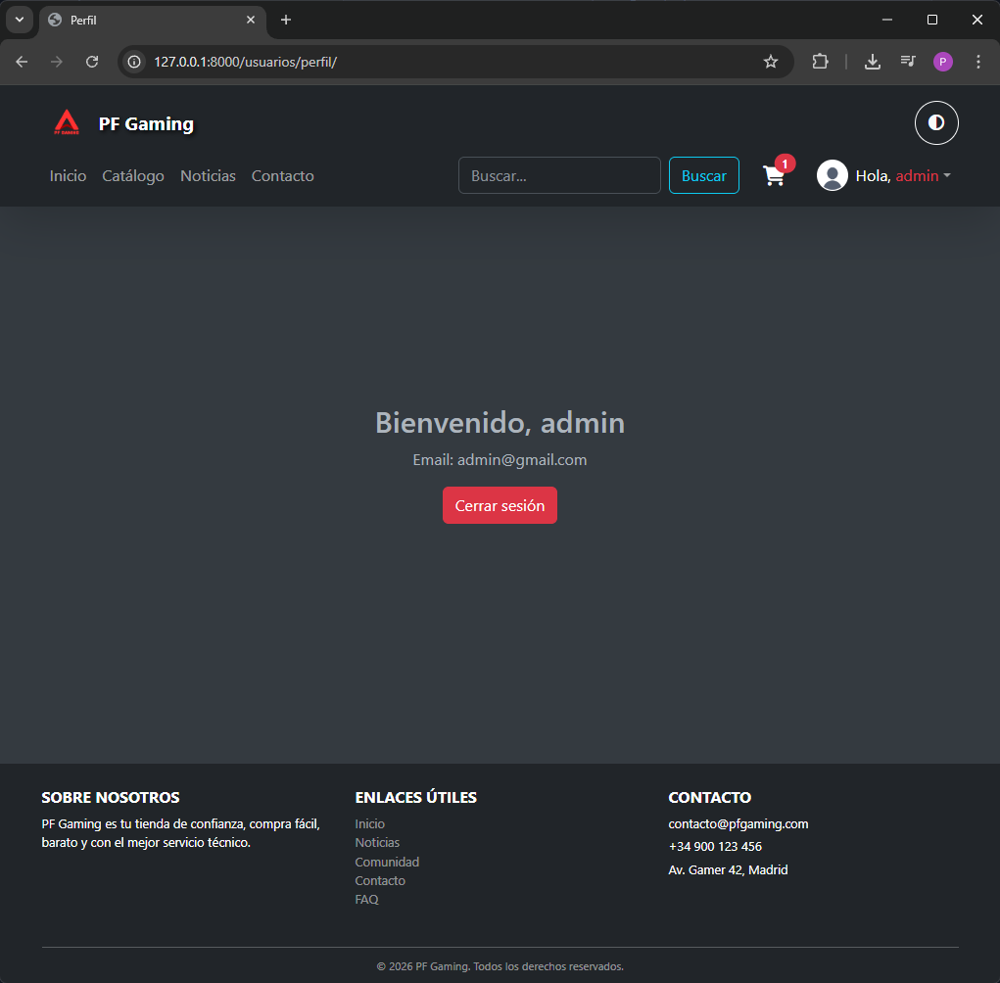
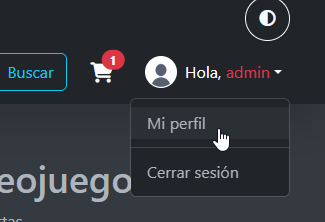
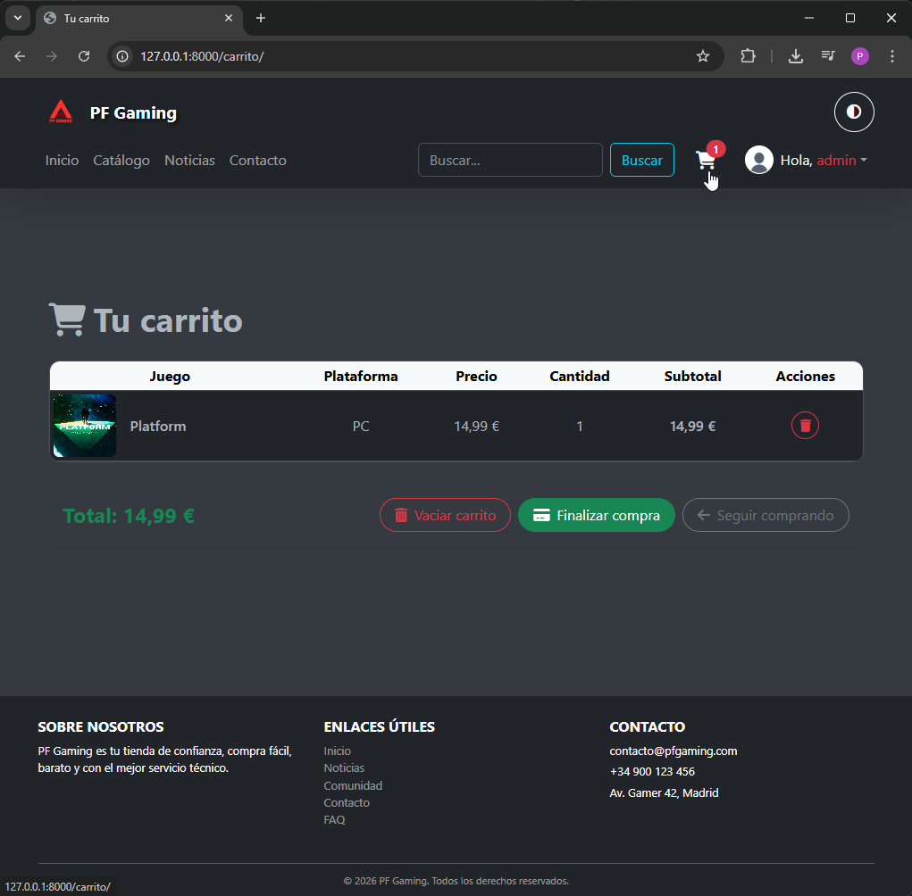
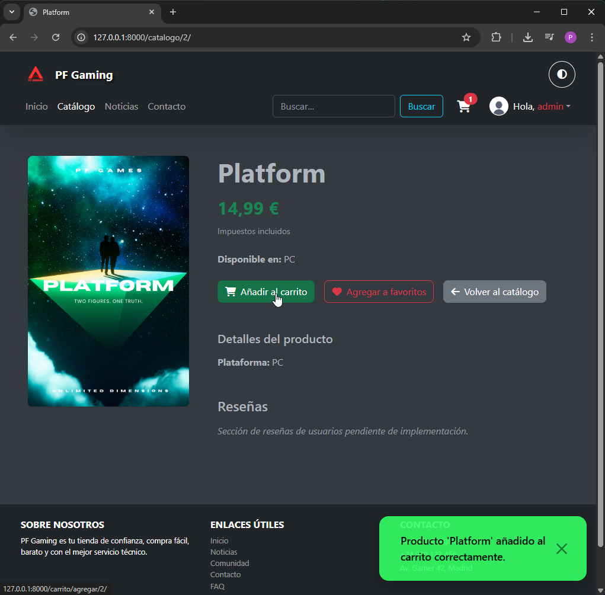
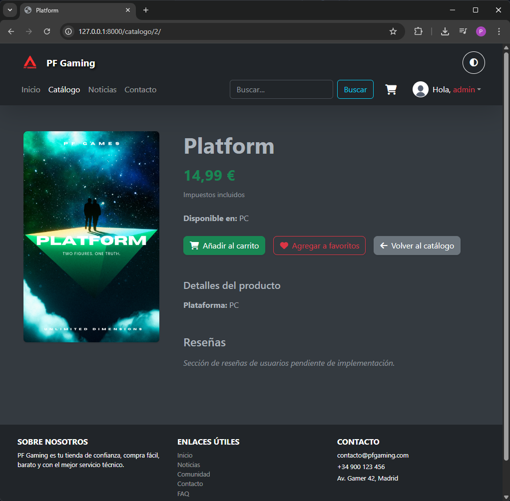
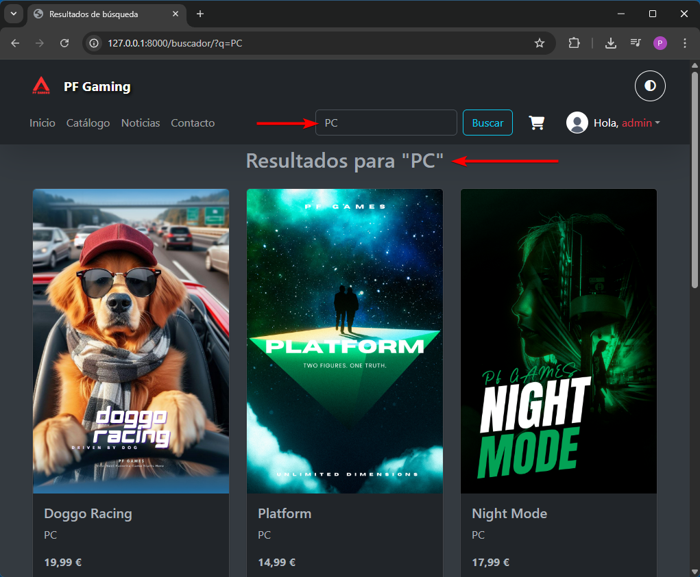

# videogame-store-django

# Django Learning Project 🎓🐍

This is a **completely free educational project** designed to help you learn how to use **Django** step by step, from the basics to building a functional web application.

The project is structured as a **26-episode YouTube series**, where each chapter explains a key concept in a practical and beginner-friendly way.

Whether you're new to web development or want to strengthen your Django skills, this course guides you through the full process of understanding backend, frontend integration, databases, authentication, and deployment.

---

## 📺 Course Playlist (26 Chapters)

**Chapter 1 – Introduction to Frontend and Backend**
[https://www.youtube.com/watch?v=vhHWY8ltHdg&list=PLVzwufPir3547OJ8KyBh-L37U-aXmaVHW&index=1](https://www.youtube.com/watch?v=vhHWY8ltHdg&list=PLVzwufPir3547OJ8KyBh-L37U-aXmaVHW&index=1)

**Chapter 2 – What Are Virtual Environments and How to Use Them**
[https://www.youtube.com/watch?v=Tgq2buXKBM0&list=PLVzwufPir3547OJ8KyBh-L37U-aXmaVHW&index=2](https://www.youtube.com/watch?v=Tgq2buXKBM0&list=PLVzwufPir3547OJ8KyBh-L37U-aXmaVHW&index=2)

**Chapter 3 – MVC and MVT Design Patterns**
[https://www.youtube.com/watch?v=hJJkpcn9ZRE&list=PLVzwufPir3547OJ8KyBh-L37U-aXmaVHW&index=3](https://www.youtube.com/watch?v=hJJkpcn9ZRE&list=PLVzwufPir3547OJ8KyBh-L37U-aXmaVHW&index=3)

**Chapter 4 – The HTTP Protocol Explained Simply**
[https://www.youtube.com/watch?v=YtzMvN80qRc&list=PLVzwufPir3547OJ8KyBh-L37U-aXmaVHW&index=4](https://www.youtube.com/watch?v=YtzMvN80qRc&list=PLVzwufPir3547OJ8KyBh-L37U-aXmaVHW&index=4)

**Chapter 5 – HTTP, HTTPS and the Requests Library**
[https://www.youtube.com/watch?v=vJaPDntfZuA&list=PLVzwufPir3547OJ8KyBh-L37U-aXmaVHW&index=5](https://www.youtube.com/watch?v=vJaPDntfZuA&list=PLVzwufPir3547OJ8KyBh-L37U-aXmaVHW&index=5)

**Chapter 6 – Browser Developer Tools**
[https://www.youtube.com/watch?v=yWamn88nock&list=PLVzwufPir3547OJ8KyBh-L37U-aXmaVHW&index=6](https://www.youtube.com/watch?v=yWamn88nock&list=PLVzwufPir3547OJ8KyBh-L37U-aXmaVHW&index=6)

**Chapter 7 – Git and GitHub for Beginners**
[https://www.youtube.com/watch?v=I0ISpY4gpKs&list=PLVzwufPir3547OJ8KyBh-L37U-aXmaVHW&index=7](https://www.youtube.com/watch?v=I0ISpY4gpKs&list=PLVzwufPir3547OJ8KyBh-L37U-aXmaVHW&index=7)

**Chapter 8 – Create a Django Project and Run the Server**
[https://www.youtube.com/watch?v=aBJbBJBGT0Y&list=PLVzwufPir3547OJ8KyBh-L37U-aXmaVHW&index=8](https://www.youtube.com/watch?v=aBJbBJBGT0Y&list=PLVzwufPir3547OJ8KyBh-L37U-aXmaVHW&index=8)

**Chapter 9 – Django Project Structure Step by Step**
[https://www.youtube.com/watch?v=X0ttzQ-2DXg&list=PLVzwufPir3547OJ8KyBh-L37U-aXmaVHW&index=9](https://www.youtube.com/watch?v=X0ttzQ-2DXg&list=PLVzwufPir3547OJ8KyBh-L37U-aXmaVHW&index=9)

**Chapter 10 – Create a Django App and Understand Its Purpose**
[https://www.youtube.com/watch?v=5QCegYVfMus&list=PLVzwufPir3547OJ8KyBh-L37U-aXmaVHW&index=10](https://www.youtube.com/watch?v=5QCegYVfMus&list=PLVzwufPir3547OJ8KyBh-L37U-aXmaVHW&index=10)

**Chapter 11 – How Views, URLs, and Templates Work in Django**
[https://www.youtube.com/watch?v=Qdc6Onp8bKQ&list=PLVzwufPir3547OJ8KyBh-L37U-aXmaVHW&index=11](https://www.youtube.com/watch?v=Qdc6Onp8bKQ&list=PLVzwufPir3547OJ8KyBh-L37U-aXmaVHW&index=11)

**Chapter 12 – Static Files in Django (CSS, JS, Images)**
[https://www.youtube.com/watch?v=c1MG27zWPOI&list=PLVzwufPir3547OJ8KyBh-L37U-aXmaVHW&index=12](https://www.youtube.com/watch?v=c1MG27zWPOI&list=PLVzwufPir3547OJ8KyBh-L37U-aXmaVHW&index=12)

**Chapter 13 – Creating a Base Template and Reusing Content**
[https://www.youtube.com/watch?v=cCY3MqIqsCg&list=PLVzwufPir3547OJ8KyBh-L37U-aXmaVHW&index=13](https://www.youtube.com/watch?v=cCY3MqIqsCg&list=PLVzwufPir3547OJ8KyBh-L37U-aXmaVHW&index=13)

**Chapter 14 – Implementing Light and Dark Mode with Bootstrap**
[https://www.youtube.com/watch?v=FK45YU4FuFc&list=PLVzwufPir3547OJ8KyBh-L37U-aXmaVHW&index=14](https://www.youtube.com/watch?v=FK45YU4FuFc&list=PLVzwufPir3547OJ8KyBh-L37U-aXmaVHW&index=14)

**Chapter 15 – Global Changes and Version Control in Django**
[https://www.youtube.com/watch?v=PrImje2n_iI&list=PLVzwufPir3547OJ8KyBh-L37U-aXmaVHW&index=15](https://www.youtube.com/watch?v=PrImje2n_iI&list=PLVzwufPir3547OJ8KyBh-L37U-aXmaVHW&index=15)

**Chapter 16 – Building a Dynamic Product Catalog**
[https://www.youtube.com/watch?v=ol7n_fVPN30&list=PLVzwufPir3547OJ8KyBh-L37U-aXmaVHW&index=16](https://www.youtube.com/watch?v=ol7n_fVPN30&list=PLVzwufPir3547OJ8KyBh-L37U-aXmaVHW&index=16)

**Chapter 17 – Using Databases in a Django Project**
[https://www.youtube.com/watch?v=qkcjewfWarM&list=PLVzwufPir3547OJ8KyBh-L37U-aXmaVHW&index=17](https://www.youtube.com/watch?v=qkcjewfWarM&list=PLVzwufPir3547OJ8KyBh-L37U-aXmaVHW&index=17)

**Chapter 18 – Modifying Existing Django Models**
[https://www.youtube.com/watch?v=YDXFZEObw5k&list=PLVzwufPir3547OJ8KyBh-L37U-aXmaVHW&index=18](https://www.youtube.com/watch?v=YDXFZEObw5k&list=PLVzwufPir3547OJ8KyBh-L37U-aXmaVHW&index=18)

**Chapter 19 – How the Django Admin Works**
[https://www.youtube.com/watch?v=SpkmYkFb6KU&list=PLVzwufPir3547OJ8KyBh-L37U-aXmaVHW&index=19](https://www.youtube.com/watch?v=SpkmYkFb6KU&list=PLVzwufPir3547OJ8KyBh-L37U-aXmaVHW&index=19)

**Chapter 20 – Pagination in Django**
[https://www.youtube.com/watch?v=79bo0oGn9uo&list=PLVzwufPir3547OJ8KyBh-L37U-aXmaVHW&index=20](https://www.youtube.com/watch?v=79bo0oGn9uo&list=PLVzwufPir3547OJ8KyBh-L37U-aXmaVHW&index=20)

**Chapter 21 – Building a Search Feature with Django QuerySets**
[https://www.youtube.com/watch?v=NaOvc8BfZlk&list=PLVzwufPir3547OJ8KyBh-L37U-aXmaVHW&index=21](https://www.youtube.com/watch?v=NaOvc8BfZlk&list=PLVzwufPir3547OJ8KyBh-L37U-aXmaVHW&index=21)

**Chapter 22 – Creating a Dynamic Product Detail View**
[https://www.youtube.com/watch?v=hqLNcguZBZw&list=PLVzwufPir3547OJ8KyBh-L37U-aXmaVHW&index=22](https://www.youtube.com/watch?v=hqLNcguZBZw&list=PLVzwufPir3547OJ8KyBh-L37U-aXmaVHW&index=22)

**Chapter 23 – User System in Django (Register, Login, Profile)**
[https://www.youtube.com/watch?v=nYVWGXI3io4&list=PLVzwufPir3547OJ8KyBh-L37U-aXmaVHW&index=23](https://www.youtube.com/watch?v=nYVWGXI3io4&list=PLVzwufPir3547OJ8KyBh-L37U-aXmaVHW&index=23)

**Chapter 24 – Building a Functional Shopping Cart**
[https://www.youtube.com/watch?v=S_55r93CwMw&list=PLVzwufPir3547OJ8KyBh-L37U-aXmaVHW&index=24](https://www.youtube.com/watch?v=S_55r93CwMw&list=PLVzwufPir3547OJ8KyBh-L37U-aXmaVHW&index=24)

**Chapter 25 – Toast Notification System (Django + Bootstrap + JS)**
[https://www.youtube.com/watch?v=gganUtkZm9E&list=PLVzwufPir3547OJ8KyBh-L37U-aXmaVHW&index=25](https://www.youtube.com/watch?v=gganUtkZm9E&list=PLVzwufPir3547OJ8KyBh-L37U-aXmaVHW&index=25)

**Chapter 26 – Production Setup and Deployment with PythonAnywhere**
[https://www.youtube.com/watch?v=qkHt1uTZLos&list=PLVzwufPir3547OJ8KyBh-L37U-aXmaVHW&index=26](https://www.youtube.com/watch?v=qkHt1uTZLos&list=PLVzwufPir3547OJ8KyBh-L37U-aXmaVHW&index=26)

---

# Project Overview

Here are some overview images of the project:

## 🎯 Goal of This Project

The objective is to provide a **practical, real-world learning path** to understand how Django works by building a complete application step by step.

✔ Backend fundamentals
✔ Frontend integration
✔ Databases and models
✔ Authentication systems
✔ Real features like search, pagination, and shopping cart
✔ Deployment to production

---

**Free. Educational. Practical. Built for learning Django from scratch.** 🚀
